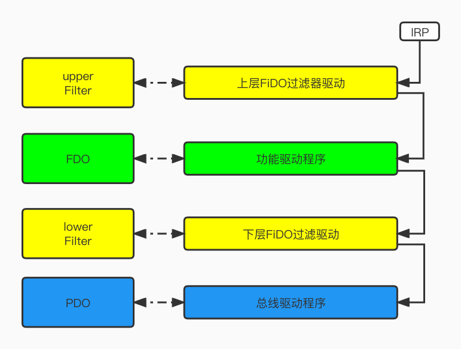
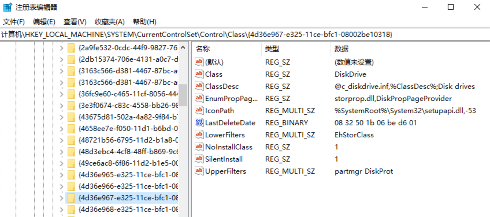
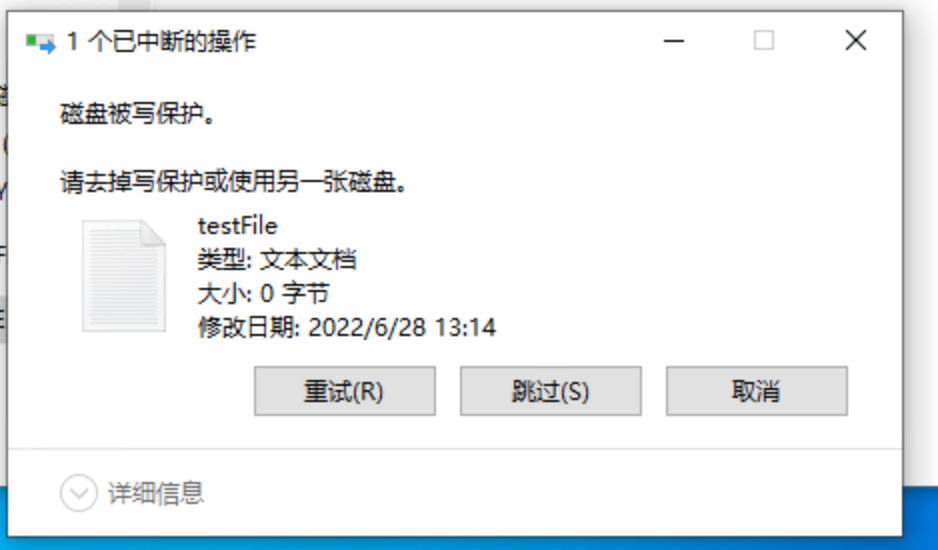

## 前言

Windows上有几种不同类型的过滤器驱动程序，从文件系统过滤器、Ndis封包过滤器到特定的PnP设备过滤器等。本文主要讲的是磁盘设备过滤器驱动(Disk Device Filter Driver)，其可以附加到本机磁盘驱动器上，过滤系统中的所有磁盘设备，实现对特定磁盘写保护的功能。

## Windows 驱动框架部分名词解释

本文涉及到的名词及缩写，在介绍设备过滤器驱动时简单科普部分名词解释。

### Windows设备对象堆栈

操作系统按照[设备对象](https://docs.microsoft.com/zh-cn/windows-hardware/drivers/kernel/types-of-wdm-device-objects)来表示设备，一个或多个设备对象与每个设备相关联，通过操作设备对象来对设备进行相关操作。



- FDO：全称为Functional Device Object，表示功能设备对象，是设备的主要驱动程序；
- PDO：全称为Physical Device Object，表示物理设备对象，但不一定是物理设备，本质是总线上的设备与总线本身之间的接口；
- FiDO：过滤器驱动，属于可选驱动程序，在FDO上方的被称为`upper filter`上层过滤器，在FDO下方的被称为`low filter` 下层过滤器。

### PnP

表示即插即用设备

### IRP

IRP(I/O request packets)是io数据请求包的缩写，是一种复杂的数据结构，用于与内核模式驱动程序进行通信，发送到设备驱动程序的大部分请求都打包在I/O请求数据包，详细的数据结构可以看msdn：[IRP结构](https://docs.microsoft.com/zh-CN/windows-hardware/drivers/ddi/wdm/ns-wdm-_irp)。

## 磁盘设备过滤器驱动实现

FIDO可以是上层过滤器或下层过滤器，上层过滤器在设备堆栈的FDO之上实例化，所以上层过滤器可以在设备的FDO设备对象看到之前，处理发送到FDO设备的IRP操作，本文主要讲的就是一个基于KMDF框架的上层过滤器驱动。

安装某一类设备驱动过滤器时，会在对应设备类([详细设备类及GUID](https://docs.microsoft.com/en-us/windows-hardware/drivers/install/system-defined-device-setup-classes-available-to-vendors))下注册对应的`UpperFilters`及`LowerFilters`键值，在收到此类设备的PnP时，系统会尝试启动对应的过滤器驱动，下图为本文的磁盘设备上层过滤器驱动的注册表值：

- 磁盘设备
  - Class = DiskDrive
  - ClassGuid = {4d36e967-e325-11ce-bfc1-08002be10318}



WDF过滤器的结构与FDO相同，在`DriverEntry`中创建WDFDRIVER对象并与框架链接，对于过滤器驱动，当PnP Manager枚举指定设备的驱动程序时，将会调用EvtDriverDeviceAdd事件用于处理回调。

### DriverEntry

在主函数中没有处理太多逻辑，主要是实例化WdfDriver对象并连接框架：

```cpp
extern "C"
NTSTATUS
DriverEntry(PDRIVER_OBJECT  DriverObject,
            PUNICODE_STRING RegistryPath)
{
    WDF_DRIVER_CONFIG config;
    NTSTATUS          status;

    WDF_DRIVER_CONFIG_INIT(&config,
                           DiskProtEvtDeviceAdd);
		//创建一个wdf驱动对象
    status = WdfDriverCreate(DriverObject,
                             RegistryPath,
                             WDF_NO_OBJECT_ATTRIBUTES,
                             &config,
                             WDF_NO_HANDLE); 

    if (!NT_SUCCESS(status)) {
#if DBG
        DbgPrint("WdfDriverCreate failed - 0x%x\n",status);
#endif
        return status;
    }
    return STATUS_SUCCESS;
}
```

### EvtDriverDeviceAdd

```cpp
_Use_decl_annotations_
NTSTATUS
DiskProtEvtDeviceAdd(WDFDRIVER       Driver,
                      PWDFDEVICE_INIT DeviceInit)
{
    NTSTATUS                  status;
    WDF_OBJECT_ATTRIBUTES     wdfObjectAttr;
    WDFDEVICE                 wdfDevice;
    PDISKPROT_DEVICE_CONTEXT devContext;
    WDF_IO_QUEUE_CONFIG       ioQueueConfig;


    //PnP管理器报告新设备存在时 回调该 api 并执行设备初始化操作
#if DBG
    DbgPrint("DiskProtEvtDeviceAdd: Adding device...\n");
#endif

    UNREFERENCED_PARAMETER(Driver);

    //PnP管理器报告新设备存在时 回调该 api 并执行设备初始化操作
    WdfFdoInitSetFilter(DeviceInit);

    //
    // 指定设备上下文
    //
    WDF_OBJECT_ATTRIBUTES_INIT_CONTEXT_TYPE(&wdfObjectAttr,
                                            DISKPROT_DEVICE_CONTEXT);

    status = WdfDeviceCreate(&DeviceInit,
                             &wdfObjectAttr,
                             &wdfDevice);

    if (!NT_SUCCESS(status)) {
#if DBG
        DbgPrint("WdfDeviceCreate failed - 0x%x\n",
                 status);
#endif
        return status;
    }
    devContext = DiskProtGetDeviceContext(wdfDevice);
    devContext->WdfDevice = wdfDevice;


    //创建默认队列 以及注册相关回调函数
    WDF_IO_QUEUE_CONFIG_INIT_DEFAULT_QUEUE(&ioQueueConfig,
                                           WdfIoQueueDispatchParallel);

    ioQueueConfig.EvtIoRead          = DiskProtEvtRead;
    ioQueueConfig.EvtIoWrite         = DiskProtEvtWrite;
    ioQueueConfig.EvtIoDeviceControl = DiskProtEvtDeviceControl;

    //
    // 创建WDF队列
    //
    status = WdfIoQueueCreate(devContext->WdfDevice,
                              &ioQueueConfig,
                              WDF_NO_OBJECT_ATTRIBUTES,
                              WDF_NO_HANDLE);

    if (!NT_SUCCESS(status)) {
#if DBG
        DbgPrint("WdfIoQueueCreate failed - 0x%x\n",
                 status);
#endif
        return status;
    }
    return STATUS_SUCCESS;
}

```

### EvtIoDeviceControl

框架通过`EvtIoDeviceControl`处理接收到的对应设备的[IOCTL请求](https://docs.microsoft.com/en-us/windows/win32/fileio/disk-management-control-codes)，本文主要实现磁盘的写保护功能，也就是需要响应`IOCTL_DISK_IS_WRITABLE` 控制请求，通过`WdfRequestComplete`返回这个磁盘受到保护的状态码`STATUS_MEDIA_WRITE_PROTECTED`。

```cpp
_Use_decl_annotations_
VOID
DiskProtEvtDeviceControl(WDFQUEUE   Queue,
                          WDFREQUEST Request,
                          size_t     OutputBufferLength,
                          size_t     InputBufferLength,
                          ULONG      IoControlCode)
{
    PDISKPROT_DEVICE_CONTEXT devContext;

    devContext = DiskProtGetDeviceContext(WdfIoQueueGetDevice(Queue));
    UNREFERENCED_PARAMETER(OutputBufferLength);
    UNREFERENCED_PARAMETER(InputBufferLength);

#if DBG
    DbgPrint("DiskProtEvtDeviceControl -- Request 0x%p\n",
             Request);
#endif
    //获取磁盘是否只读IOCTL
    if (IoControlCode == IOCTL_DISK_IS_WRITABLE) {
        if(DiskProtGetBusType(devContext) == STORAGE_BUS_TYPE::BusTypeUsb)
        {
            //返回一个只读的状态码
            WdfRequestComplete(Request, STATUS_MEDIA_WRITE_PROTECTED);
            return;
        }
        FilterSendWithCallback(Request,
                                    devContext);
        return;
    }
    FilterSendAndForget(Request,
                           devContext);
}
```

另一个问题，如何判断这个磁盘是需要进行写入保护的磁盘？此处的做法是通过磁盘的`IOCTL_STORAGE_QUERY_PROPERTY` 来获取当前设备对象的磁盘信息，通过获取总线结构，判断当前磁盘类型，只对一类总线结构的类型进行写保护，同时此处也可以自由拓展，由应用层来决定对某些磁盘的保护控制。

```cpp
_Use_decl_annotations_
STORAGE_BUS_TYPE DiskProtGetBusType(PDISKPROT_DEVICE_CONTEXT devContext)
{
    WDFIOTARGET                 hidTarget = nullptr;
    WDF_MEMORY_DESCRIPTOR       outputDescriptor;
    STORAGE_PROPERTY_QUERY  query = {};
    PSTORAGE_DESCRIPTOR_HEADER  descriptor = nullptr;
    PSTORAGE_DEVICE_DESCRIPTOR  DeviceDescriptor = nullptr;
    STORAGE_BUS_TYPE currentBusType = STORAGE_BUS_TYPE::BusTypeUnknown;
    hidTarget = WdfDeviceGetIoTarget(devContext->WdfDevice);

    WDF_MEMORY_DESCRIPTOR_INIT_BUFFER(&outputDescriptor,
        (PVOID)&query,
        sizeof(STORAGE_PROPERTY_QUERY));

    query.PropertyId = StorageDeviceProperty;
    query.QueryType = PropertyStandardQuery;

    descriptor = (PSTORAGE_DESCRIPTOR_HEADER)&query;
    NTSTATUS status = WdfIoTargetSendIoctlSynchronously(hidTarget,
        NULL,
        IOCTL_STORAGE_QUERY_PROPERTY,
        &outputDescriptor,
        &outputDescriptor,
        NULL,
        NULL);

    if (!NT_SUCCESS(status))
    {
        DbgPrint("DiskProtEvtDeviceControl WdfIoTargetSendIoctlSynchronously failed 0x%x\n", status);
        return currentBusType;
    }
    else
    {
        DbgPrint("DiskProtEvtDeviceControl %d\n", descriptor->Size);

        ULONG                   bufferLength = 0;
        bufferLength = descriptor->Size;
        NT_ASSERT(bufferLength >= sizeof(STORAGE_PROPERTY_QUERY));
        bufferLength = max(bufferLength, sizeof(STORAGE_PROPERTY_QUERY));
        descriptor = (PSTORAGE_DESCRIPTOR_HEADER)ExAllocatePoolWithTag(NonPagedPoolNx, bufferLength, 'GYqw');
        RtlZeroMemory(&query, sizeof(STORAGE_PROPERTY_QUERY));
        query.PropertyId = StorageDeviceProperty;
        query.QueryType = PropertyStandardQuery;
        RtlCopyMemory(descriptor,
            &query,
            sizeof(STORAGE_PROPERTY_QUERY));

        //开辟完空间重新获取数据
        WDF_MEMORY_DESCRIPTOR_INIT_BUFFER(&outputDescriptor,
            (PVOID)descriptor,
            bufferLength);

        status = WdfIoTargetSendIoctlSynchronously(hidTarget,
            NULL,
            IOCTL_STORAGE_QUERY_PROPERTY,
            &outputDescriptor,
            &outputDescriptor,
            NULL,
            NULL);
        DeviceDescriptor = (PSTORAGE_DEVICE_DESCRIPTOR)descriptor;
        DbgPrint("DiskProtEvtDeviceControl StorageDeviceProperty %d\n", DeviceDescriptor->BusType);
        currentBusType = DeviceDescriptor->BusType;
        FREE_POOL(DeviceDescriptor);
    }
   
    return currentBusType;
}
```

### Install inf

需要在[inf安装文件](https://docs.microsoft.com/en-us/windows-hardware/drivers/install/writing-inf-files)中指定需要附加在哪一类设备以及需要提供相应的GUID，此外还需要在注册表中指定为`UpperFilters，此外在inf中指定驱动的启动类型，SERVICE_BOOT_START表示由操作系统(OS)加载程序启动的驱动。

```ini
[Version]
Signature   = "$Windows NT$"
Class       = %ClassNameToFilter%   
ClassGUID   = %ClassGUIDToFilter% 
Provider    = %Provider%
DriverVer   = 
CatalogFile = DiskProt.cat


[DefaultInstall.NT]
CopyFiles = @DiskProt.sys
Addreg    = DiskProt.AddReg

[DestinationDirs]
DefaultDestDir = 12

[DiskProt.AddReg]
HKLM, System\CurrentControlSet\Control\Class\%ClassGUIDToFilter%, UpperFilters, 0x00010008, %DriverName%     


[DefaultInstall.NT.Services]
AddService = DiskProt, , DiskProt.Service.Install

[DiskProt.Service.Install]
DisplayName      = %ServiceName%
Description      = %ServiceDescription%
ServiceBinary    = %12%\%DriverName%.sys        
ServiceType      = 1                            ;SERVICE_KERNEL_DRIVER
StartType        = 0                            ;SERVICE_BOOT_START 
ErrorControl     = 1                            ;SERVICE_ERROR_NORMAL
AddReg           = KMDFVerifierAddReg


[KMDFVerifierAddReg]
HKR, Parameters\Wdf,VerifierOn,0x00010001,1
HKR, Parameters\Wdf,VerboseOn,0x00010001,1
HKR, Parameters\Wdf,DbgBreakOnError,0x00010001,1


[SourceDisksFiles]
DiskProt.sys=1

[SourceDisksNames]
1 = %DiskName%


[Strings]
ClassGUIDToFilter       = "{4d36e967-e325-11ce-bfc1-08002be10318}"
ClassNameToFilter       = "DiskDrive" 
Provider                = "yunshanwuyin"
ServiceDescription      = "disk protect"
ServiceName             = "DiskProt"
DriverName              = "DiskProt"
DiskName                 = "DiskProt Installation Disk"

```

## 效果



## 注意事项

关于磁盘相关的驱动，最好[配置双击调试](https://docs.microsoft.com/zh-cn/windows-hardware/drivers/gettingstarted/provision-a-target-computer-wdk-8-1)进行测试，否则可能由于某些代码或安装问题导致蓝屏，处理起来会很麻烦，数据的安全性也无法保证。

## 扩展

1.存储类设备除了使用驱动进行控制，应用层通过修改注册表以及策略组，也可以达到只读、禁用等功能；

- 应用层禁用USB设备

  注册表位置：`HKEY_LOCAL_MACHINE\SYSTEM\CurrentControlSet\Services\USBSTOR`

  修改`start`项：3表示启用、4表示禁用

- 应用层限制USB存储设备写保护

  注册表位置：`HKEY_LOCAL_MACHINE\SYSTEM\CurrentControlSet\Control\StorageDevicePolicies`
  
  修改`WriteProtect`项：0表示不限制只读，1表示限制为只读
  
  修改注册表的策略并不是实时生效的，在修改完之后重新接入U盘，策略才会生效

2.手机类型设备属于WPD设备，控制需要使用其他的ClassGuid进行管理，在应用层想要限制WPD设备的相关操作，需要配置策略组，home版本没有策略组的同样可以通过修改注册表来解决，如果注册表中无下列项，可自行创建。

- 应用层WPD设备禁用以及只读策略

  注册表位置：`HKEY_LOCAL_MACHINE\Software\Policies\Microsoft\Windows\RemovableStorageDevices\{6AC27878-A6FA-4155-BA85-F98F491D4F33}`

  包含两个项`Deny_Read`，`Deny_Write： 0表示正常读取、写入1表示禁用

- 开启策略：wpd的策略设置完成之后还需要配置开启策略的选项

  注册表位置：`HKEY_LOCAL_MACHINE\SOFTWARE\Policies\Microsoft\Windows\RemovableStorageDevices\{F33FDC04-D1AC-4E8E-9A30-19BBD4B108AE}`

  包含两个项`Deny_Read`,`Deny_Write`：0表示禁用对应的读取/写入策略、1表示启用策略

